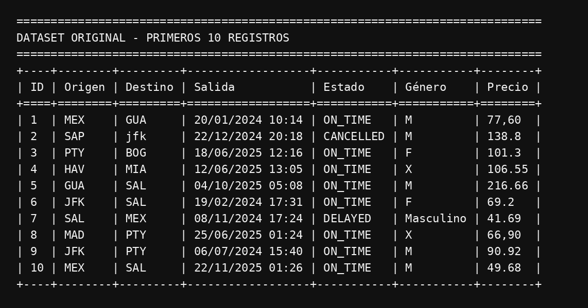
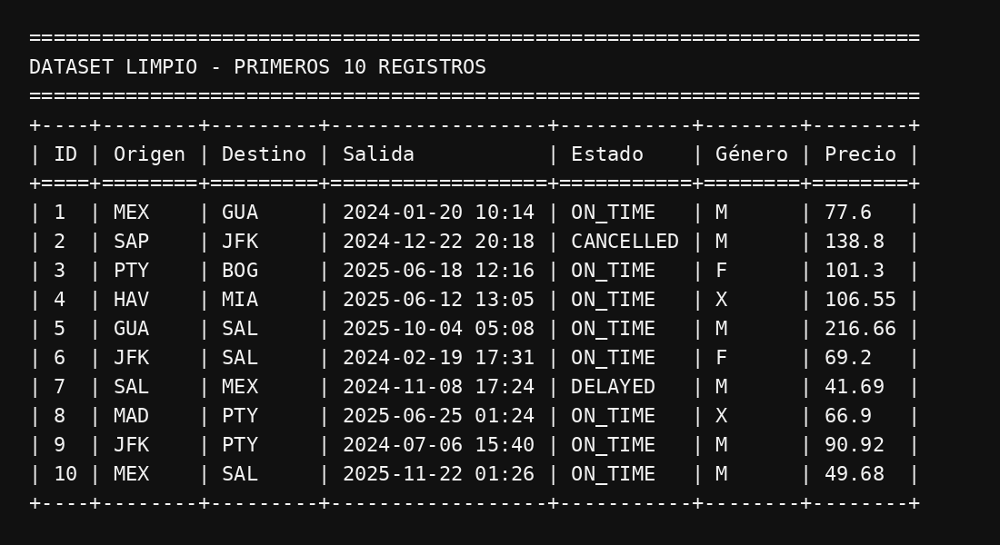
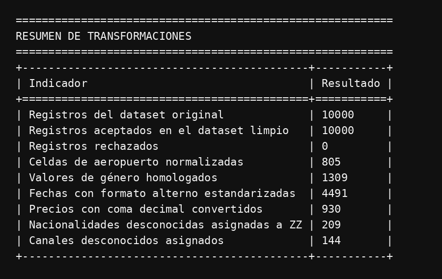
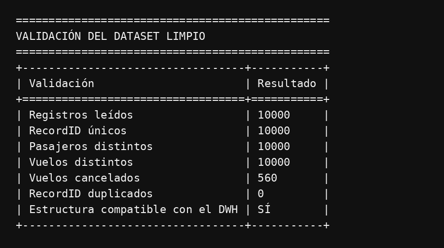
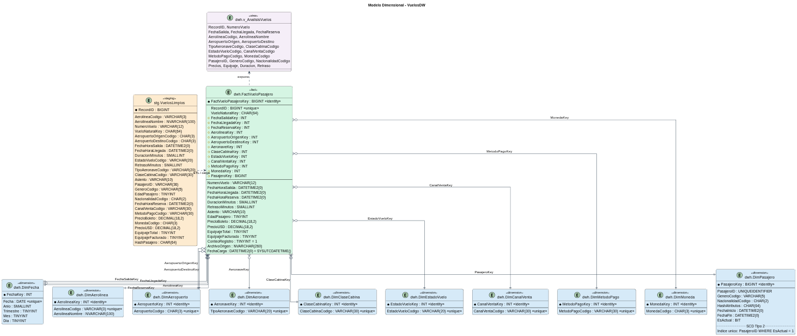

# Proceso ETL y modelo multidimensional de vuelos

## Descripción

La práctica tiene como objetivo desarrollar un proceso ETL en Python para extraer, transformar y cargar registros de vuelos desde fuentes crudas hacia un modelo multidimensional en Microsoft SQL Server. La información debe limpiarse, homologarse y estandarizarse para permitir su validación mediante consultas analíticas.

El programa inicia exclusivamente desde el dataset crudo, genera el dataset limpio y carga el resultado en el modelo dimensional. El modelo conserva el historial de atributos del pasajero mediante una dimensión de cambio lento tipo 2 (SCD Tipo 2) y evita duplicar hechos cuando se procesa nuevamente el mismo archivo.

## Objetivos implementados

- Extraer los registros desde el dataset original.
- Limpiar, homologar y estandarizar los datos mediante Python.
- Generar y conservar el dataset limpio dentro de la práctica.
- Validar la estructura del resultado antes de conectarse a SQL Server.
- Implementar un modelo dimensional con integridad referencial.
- Mantener cambios históricos de pasajeros mediante SCD Tipo 2.
- Ejecutar una carga transaccional e idempotente desde staging.
- Proporcionar consultas SQL para validar el resultado de la carga.

## Estructura

```text
Practica1/
├── data/
│   ├── dataset_vuelos_crudo.csv
│   └── dataset_vuelos_limpio.csv
├── images/
│   ├── muestra_dataset_original.png
│   ├── muestra_dataset_limpio.png
│   ├── resumen_transformaciones.png
│   └── validacion_dataset.png
├── sql/
│   ├── modelo_dwh.sql
│   └── carga_validacion_dwh.sql
├── src/
│   └── cargar_modelo.py
├── requirements.txt
└── README.md
```

`cargar_modelo.py` ejecuta la extracción del CSV crudo, la transformación, la exportación del CSV limpio y la carga del resultado hacia SQL Server.

## Datasets

### Dataset original

`data/dataset_vuelos_crudo.csv` contiene 10,000 registros y 26 columnas. Conserva variaciones de formato que requieren limpieza, entre ellas aeropuertos en minúsculas, categorías de género heterogéneas, fechas con diferentes formatos, precios con coma decimal y valores categóricos vacíos.



La primera tabla presentada por el programa permite observar directamente estas variaciones en el archivo crudo.

### Dataset limpio

`data/dataset_vuelos_limpio.csv` se genera automáticamente desde el archivo crudo. Contiene 10,000 registros aceptados y 28 columnas preparadas para el modelo dimensional. Incluye nombres normalizados, tipos compatibles con SQL Server, una clave natural SHA-256 para el vuelo y un hash de atributos para detectar cambios del pasajero.



La segunda tabla presenta las mismas variables después de la estandarización.

## Resultados de la transformación

La comparación reproducible de ambos archivos confirma los siguientes tratamientos:

- Conversión de códigos de aeropuerto a mayúsculas.
- Homologación de género a `M`, `F` o `X`.
- Estandarización de fechas a un formato uniforme.
- Conversión de precios con coma decimal a valores numéricos.
- Asignación de `ZZ` cuando la nacionalidad es desconocida.
- Asignación de `DESCONOCIDO` cuando falta el canal de venta.
- Conservación de nulos válidos en vuelos cancelados.
- Generación de identificadores SHA-256 para vuelos y cambios de pasajero.



El resumen se calcula automáticamente comparando ambos CSV durante la ejecución del programa.

Antes de realizar la carga, el programa comprueba la estructura, la unicidad de los registros y la compatibilidad de los datos con el modelo dimensional.



## Diagrama de BD




## Granularidad y modelo dimensional

La tabla `FactVueloPasajero` almacena una fila por pasajero, reserva y segmento de vuelo. `RecordID` identifica cada registro del archivo y garantiza la idempotencia de la carga.

`VueloNaturalKey` identifica una instancia de vuelo mediante aerolínea, número de vuelo, fecha y hora de salida, aeropuerto de origen y aeropuerto de destino.

| Componente | Función |
|---|---|
| `FactVueloPasajero` | Contiene claves, tiempos, retrasos, precios, equipaje y conteo de registros. |
| `DimFecha` | Cumple los roles de salida, llegada y reserva. |
| `DimAeropuerto` | Cumple los roles de origen y destino. |
| `DimPasajero` | Conserva género y nacionalidad mediante SCD Tipo 2. |
| Dimensiones descriptivas | Representan aerolínea, aeronave, cabina, estado, canal, pago y moneda. |

Las dimensiones descriptivas utilizan llaves subrogadas `IDENTITY`, mientras que la tabla de hechos conserva dichas llaves como referencias foráneas. `DimFecha` emplea una llave entera con formato `AAAAMMDD`, adecuada para sus roles de fecha de salida, llegada y reserva.

La dimensión de fecha almacena `Anio`, `Trimestre`, `Mes` y `Dia` en columnas independientes. Esta estructura permite recorrer la jerarquía analítica Año → Trimestre → Mes → Día sin depender del texto original de las fechas.

La edad se conserva en la tabla de hechos porque representa un valor observado en cada evento y el dataset no proporciona fecha de nacimiento.

## Dimensión SCD Tipo 2

`DimPasajero` utiliza:

- `PasajeroKey`: clave sustituta relacionada con los hechos.
- `PasajeroID`: clave natural del pasajero.
- `HashAtributos`: hash de género y nacionalidad.
- `FechaInicio`: inicio de vigencia de la versión.
- `FechaFin`: final de vigencia de la versión histórica.
- `EsActual`: indicador de la versión vigente.

Cuando el hash recibido difiere del hash vigente, el procedimiento cierra la versión actual e inserta una nueva fila con otra clave sustituta. Los hechos anteriores continúan relacionados con la versión histórica correspondiente. Un índice único filtrado impide que un pasajero tenga más de una versión actual.

## Proceso ETL

1. Leer las 26 columnas del dataset crudo.
2. Eliminar duplicados y estandarizar textos, fechas, categorías y números.
3. Generar las claves SHA-256 y exportar las 28 columnas limpias.
4. Validar el resultado antes de establecer la conexión.
5. Reemplazar la tabla de staging dentro de una transacción.
6. Insertar únicamente valores nuevos en las dimensiones estáticas.
7. Generar una nueva versión SCD Tipo 2 cuando existan cambios.
8. Resolver las claves sustitutas e insertar únicamente hechos nuevos.
9. Comparar la cantidad cargada con la cantidad recibida en staging.

## Requisitos

- Python 3.10 o superior.
- Microsoft SQL Server.
- Microsoft ODBC Driver 18 for SQL Server.
- Librerías `pandas`, `SQLAlchemy` y `pyodbc`.

Las dependencias de Python se instalan desde el archivo incluido:

```powershell
python -m pip install -r requirements.txt
```

Microsoft ODBC Driver 18 se instala por separado porque corresponde al sistema operativo y no a un paquete de Python.

## Configuración de conexión

Las credenciales se proporcionan mediante variables de entorno y no se almacenan en el código.

Ejemplo en PowerShell:

```powershell
$env:DB_SERVER="localhost,1433"
$env:DB_DATABASE="VuelosDW"
$env:DB_USERNAME="sa"
$env:DB_PASSWORD="SU_CLAVE"
```

`DB_DATABASE` y `DB_DRIVER` son opcionales. Sus valores predeterminados son `VuelosDW` y `ODBC Driver 18 for SQL Server`.

## Ejecución

Los comandos se ejecutan desde la carpeta raíz `Practica1`.

### Preparación del DWH

1. Ejecutar `sql/modelo_dwh.sql` en SQL Server Management Studio.
2. Ejecutar `sql/carga_validacion_dwh.sql` para crear el procedimiento.
3. Configurar las variables de conexión.
4. Ejecutar la carga:

```powershell
python src/cargar_modelo.py
```

El programa presenta consecutivamente la muestra original, la muestra limpia, el resumen de transformaciones y la validación del dataset. Después de estas salidas, carga staging y ejecuta el procedimiento del DWH.

En cada ejecución, `data/dataset_vuelos_limpio.csv` se vuelve a generar desde `data/dataset_vuelos_crudo.csv`; el archivo limpio no se utiliza como entrada del proceso.

Después de la carga, ejecutar nuevamente la sección de consultas técnicas incluida al final de `sql/carga_validacion_dwh.sql`.
