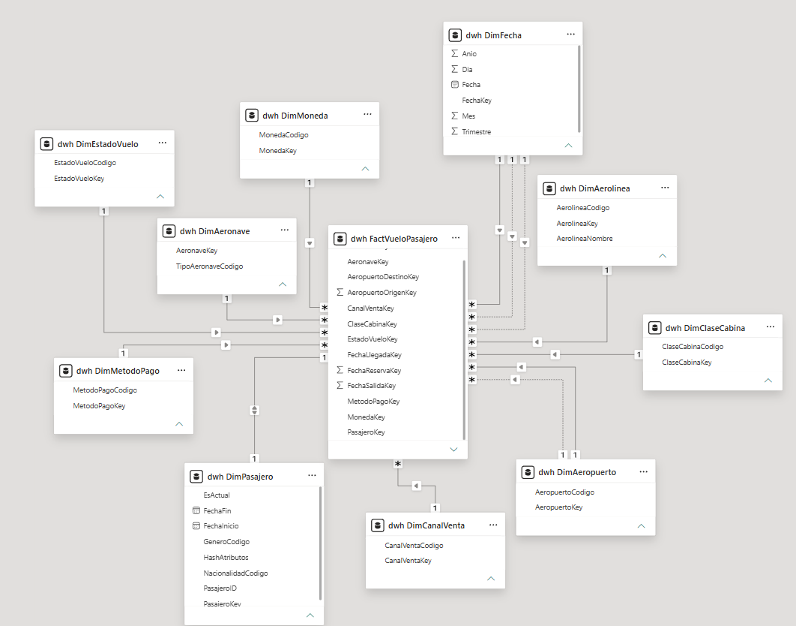
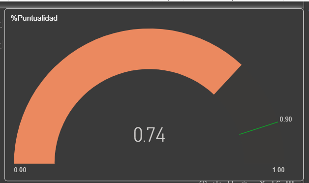
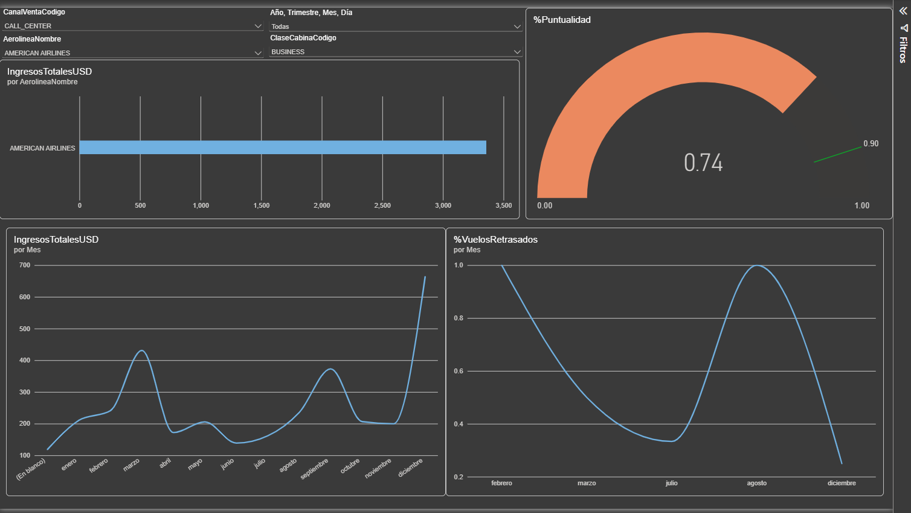
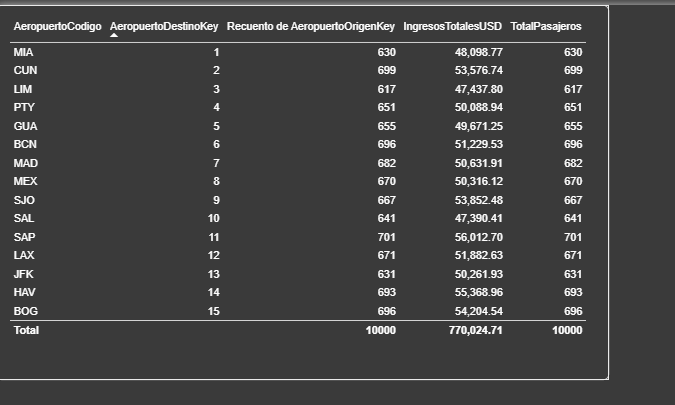

# Seminario de Sistemas 2
## Práctica 2

### 1. Estructura del Modelo Multidimensional
El modelo de datos implementado en Microsoft SQL Server sigue una arquitectura de esquema en estrella, diseñado para soportar consultas analíticas eficientes. El núcleo del modelo es la tabla de hechos `dwh.FactVueloPasajero`, la cual almacena una fila por cada pasajero, reserva y segmento de vuelo. Esta tabla centraliza las métricas cuantitativas (como el precio en USD, retraso en minutos y equipaje) y las claves foráneas.



Para proporcionar contexto a estos hechos, el modelo integra múltiples dimensiones descriptivas:
*   **Dimensiones estáticas:** Incluyen entidades como `DimAerolinea`, `DimAeronave`, `DimAeropuerto`, `DimClaseCabina` y `DimEstadoVuelo`.
*   **Dimensión de rol (Role-playing dimension):** `DimFecha` se utiliza en múltiples contextos dentro de la tabla de hechos, representando de forma independiente la fecha de salida, la fecha de llegada y la fecha de reserva.
*   **Dimensión de Cambio Lento (SCD Tipo 2):** `DimPasajero` preserva el historial de los atributos de los clientes (como nacionalidad y género), permitiendo relacionar los hechos históricos con la versión exacta del pasajero en el momento del vuelo.

### 2. Medidas DAX Implementadas
Para resolver los requerimientos analíticos del negocio y cumplir con el alcance de la práctica, se construyeron las siguientes expresiones de análisis de datos (DAX):

*   **IngresosTotalesUSD:**
    ```dax
    IngresosTotalesUSD = SUM('dwh FactVueloPasajero'[PrecioUSD])
    ```
    *Justificación:* Totaliza la columna de precios en dólares de la tabla de hechos, brindando el indicador principal de rentabilidad del negocio.

*   **TotalPasajeros:**
    ```dax
    TotalPasajeros = DISTINCTCOUNT('dwh FactVueloPasajero'[PasajeroKey])
    ```
    *Justificación:* Realiza un recuento único de las llaves de pasajeros en la tabla de hechos, asegurando que se contabilice el volumen real de clientes atendidos.

*   **%VuelosRetrasados:**
    ```dax
    %VuelosRetrasados = 
    DIVIDE(
        CALCULATE(COUNTROWS('dwh FactVueloPasajero'), 'dwh FactVueloPasajero'[RetrasoMinutos] > 15),
        COUNTROWS('dwh FactVueloPasajero')
    )
    ```
    *Justificación:* Calcula la proporción de vuelos que experimentaron una demora operativa significativa (mayor a 15 minutos) frente al total de vuelos registrados.

*   **%Puntualidad:**
    ```dax
    %Puntualidad = 1 - [%VuelosRetrasados]
    ```
    *Justificación:* Actúa como la métrica inversa a los retrasos, estableciendo el porcentaje de éxito en el cumplimiento de los itinerarios.

### 3. Interpretación de KPIs (Indicadores Clave de Desempeño)
El indicador estratégico principal del tablero es el **KPI de Puntualidad**, visualizado a través de un gráfico de medidor (Gauge) en la página principal. 

Este KPI consolida la medida `%Puntualidad` (cuyo valor actual refleja un 0.74 o 74%) y opera visualmente como un semáforo, cumpliendo con el requerimiento de la práctica. La relevancia estratégica de este indicador radica en que permite a la gerencia evaluar la calidad del servicio operativo de un vistazo; valores cercanos a 1.00 (color verde) indican eficiencia operativa, mientras que la barra naranja advierte sobre áreas de mejora en la gestión de tiempos de las aerolíneas.



### 4. Decisiones de Diseño y Visualizaciones
El diseño visual se segmentó en dos páginas para separar el análisis de tendencias operativas del detalle transaccional.

#### Página 1: Dashboard Operativo
*   **Filtros Interactivos:** Se incorporaron segmentadores en la parte superior (CanalVentaCodigo, AerolineaNombre, Jerarquía de Fecha y ClaseCabinaCodigo). Esto garantiza que el dashboard sea dinámico y permite a los tomadores de decisiones aislar escenarios específicos.
*   **Gráfico de Barras (Ingresos por Aerolínea):** Permite identificar rápidamente cuál aerolínea genera el mayor impacto financiero.
*   **Gráficos de Líneas (Tendencias Mensuales):** Se emplearon dos gráficos de líneas para rastrear los `IngresosTotalesUSD` y el `%VuelosRetrasados` a lo largo de los meses. Esta decisión facilita la identificación de patrones estacionales (por ejemplo, picos de ingresos en marzo/diciembre y fluctuaciones en los retrasos).
*   **KPI Principal:** Ubicado en la esquina superior derecha para capturar la atención inmediata sobre el cumplimiento del servicio.



#### Página 2: Detalle Analítico
*   **Tabla de Datos:** Se implementó un objeto visual de matriz/tabla que desglosa el rendimiento por `AeropuertoCodigo`. 
*   **Decisión de diseño:** Presentar los `IngresosTotalesUSD` y el `TotalPasajeros` a nivel de aeropuerto permite al equipo operativo detectar los nodos geográficos más rentables y con mayor tráfico, facilitando la toma de decisiones sobre asignación de recursos o futuras expansiones de rutas.

