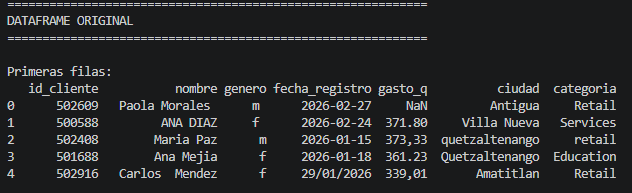
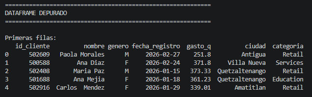
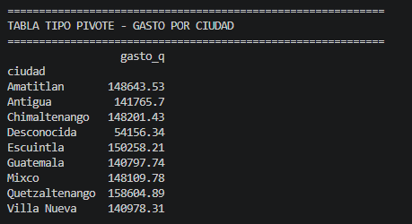
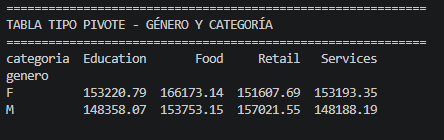
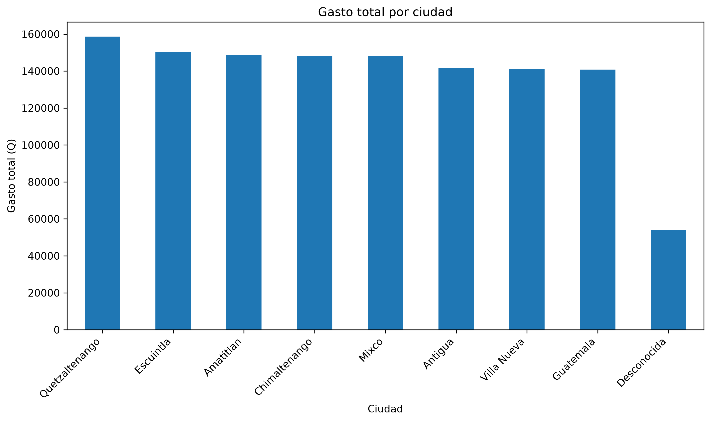
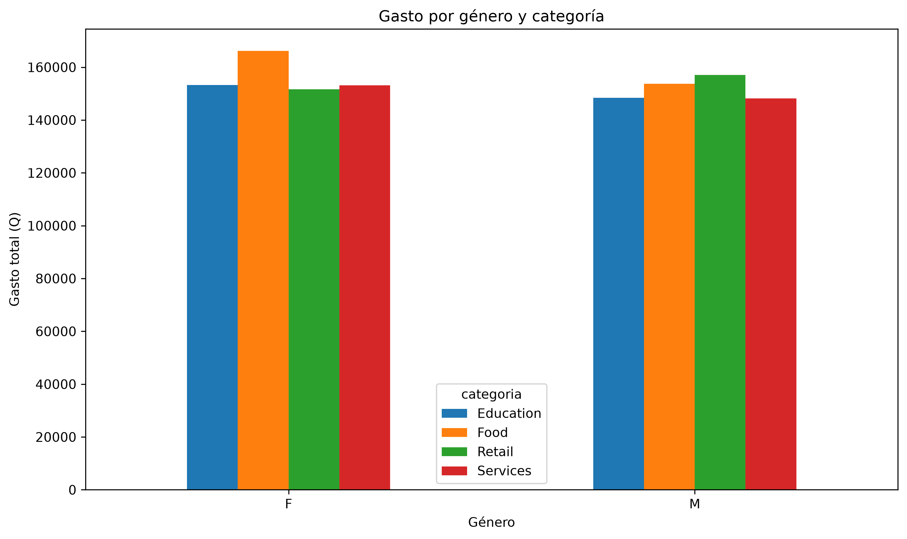

# Tarea 1 — Limpieza y análisis inicial de datos con Python y Pandas

## 1. Nombre del dataset

**Dataset utilizado:** `dataset_sucio.csv`

El dataset contiene información de clientes y sus gastos, con las siguientes columnas:

- `id_cliente`
- `nombre`
- `genero`
- `fecha_registro`
- `gasto_q`
- `ciudad`
- `categoria`

---

## 2. Proceso de limpieza aplicado

### Eliminación de duplicados

El dataset original contenía **5,000 registros** y **100 registros duplicados**.

Se utilizó `drop_duplicates()` para eliminar los registros repetidos. Después de este proceso, el dataset quedó con **4,900 registros**.

### Tratamiento de celdas vacías

En el dataset original se encontraron:

- **60 valores faltantes** en `genero`.
- **505 valores faltantes** en `gasto_q`.
- **157 valores faltantes** en `ciudad`.

Para tratar estos valores:

- Los valores faltantes de `genero` fueron completados utilizando la **moda**.
- Los valores faltantes de `ciudad` fueron reemplazados por **`Desconocida`**.
- Los valores faltantes de `gasto_q` fueron completados utilizando la **mediana**.

### Estandarización de valores y formatos

Se realizaron las siguientes transformaciones:

- Se eliminaron espacios innecesarios en las columnas de texto.
- `genero` se convirtió a mayúsculas.
- `nombre` se estandarizó utilizando formato tipo título.
- `ciudad` se estandarizó utilizando formato tipo título.
- `categoria` se estandarizó utilizando formato tipo título.
- `gasto_q` se convirtió a formato numérico.
- Se estandarizaron las fechas que se encontraban en formatos `YYYY-MM-DD` y `DD/MM/YYYY`.

---

## 3. Estado original y estado depurado

Antes de realizar la limpieza, el dataset tenía **5,000 registros**, **100 duplicados** y valores faltantes en las columnas `genero`, `gasto_q` y `ciudad`.

La captura muestra las primeras filas del dataset original y permite observar algunas de las inconsistencias presentes en los datos, como diferentes formatos de género, ciudad, categoría, fechas y valores faltantes.

Después del proceso de limpieza, el dataset quedó con **4,900 registros**, **0 duplicados** y **0 valores faltantes**.

La información quedó estandarizada y preparada para realizar el análisis mediante tablas tipo pivote y visualizaciones.

---

## 4. Tabla tipo pivote: gasto total por ciudad

Se generó una tabla tipo pivote utilizando `ciudad` como índice y `gasto_q` como valor, aplicando la función de suma.

La ciudad con mayor gasto total es **Quetzaltenango**, con **Q158,604.89**.

Le siguen **Escuintla**, con **Q150,258.21**, y **Amatitlan**, con **Q148,643.53**.

La ciudad con menor gasto total es **Desconocida**, con **Q54,156.34**. Este resultado corresponde a los registros en los que originalmente no se contaba con información de ciudad.

La tabla permite observar las diferencias en el gasto acumulado entre las distintas ciudades.

---

## 5. Tabla tipo pivote: gasto por género y categoría

Se generó una segunda tabla tipo pivote utilizando `genero` como índice, `categoria` como columnas y `gasto_q` como valor.

Para el género **F**, la categoría con mayor gasto es **Food**, con **Q166,173.14**.

Para el género **M**, la categoría con mayor gasto es **Retail**, con **Q157,021.55**.

En el género **F**, las categorías Education y Services presentan valores similares, mientras que en el género **M** Education y Services también presentan valores cercanos entre sí.

Esta tabla permite comparar el comportamiento del gasto según el género y la categoría.

---

## 6. Visualizaciones

### Gasto total por ciudad

La gráfica permite visualizar y comparar el gasto total acumulado de cada ciudad. Se observa que **Quetzaltenango** presenta el mayor gasto total, mientras que **Desconocida** presenta el menor.

### Gasto por género y categoría

La gráfica permite comparar visualmente el gasto de los géneros F y M en las diferentes categorías. Se observa que para **F** destaca la categoría **Food**, mientras que para **M** destaca **Retail**.

---

## 7. Interpretación de los resultados

El proceso de limpieza permitió mejorar la calidad y consistencia del dataset. Se eliminaron los registros duplicados y se trataron todos los valores faltantes sin eliminar los registros correspondientes.

La estandarización permitió que valores que originalmente tenían diferentes formatos fueran representados de manera uniforme. También se normalizaron las fechas y se convirtió el gasto a un formato numérico adecuado para realizar operaciones y análisis.

A partir de la exploración realizada, **Quetzaltenango** presenta el mayor gasto total por ciudad. En el análisis por género y categoría, **Food** representa el mayor gasto para F, mientras que **Retail** representa el mayor gasto para M.

Las tablas tipo pivote y las visualizaciones permiten identificar estas diferencias y facilitan la interpretación de los datos después del proceso de limpieza.
